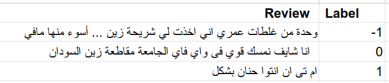
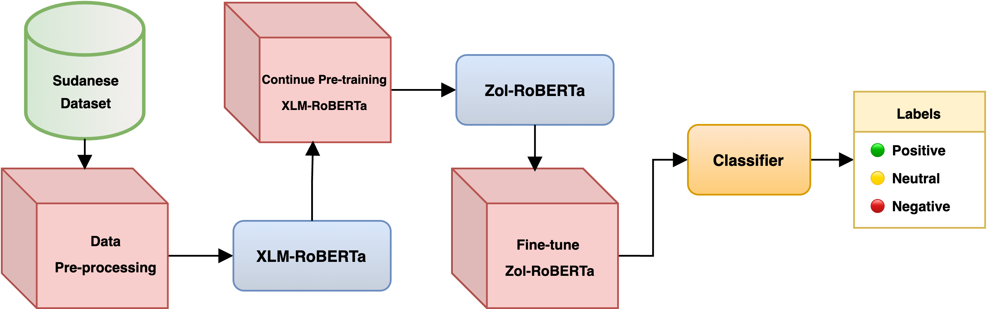
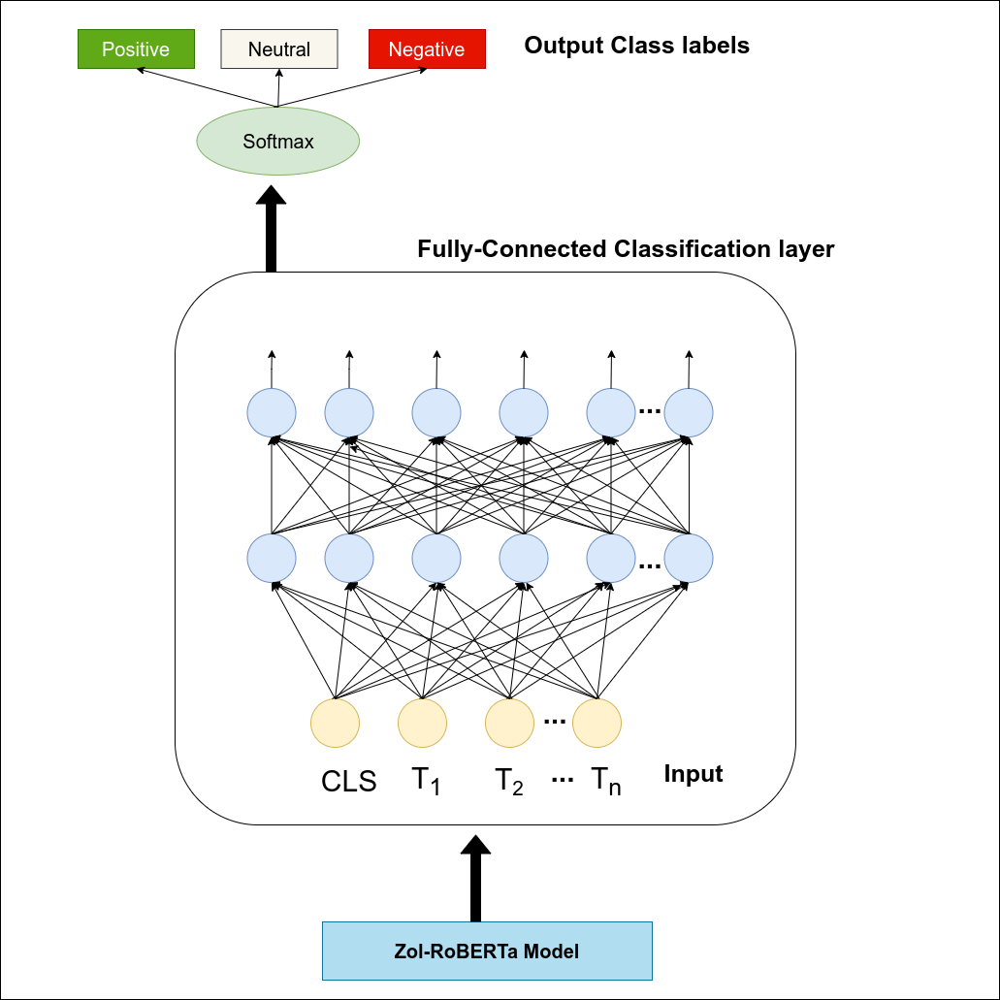

# Sudanese-Arabic-Dialect-Encoding-Using-XLM-RoBERTa-(Zol-RoBERTa) 
University Of Khartoum BSc Thesis Project


## Overview

This project, "Zol-RoBERTa" is a development of a language model specifically for the Sudanese-Arabic dialect using the XLM-RoBERTa architecture. The model was pre-trained on a Sudanese corpus enhancing the understanding of this underrepresented dialect in NLP research. The project's core achievement is leveraging Multilingual RoBERTa to accommodate the linguistic characteristics of the Sudanese dialect, providing a crucial resource for processing this language. The model's performance was evaluated through Sentiment Analysis, showcasing significant improvements in handling both the Sudanese dialect and Modern Standard Arabic. This work marks a significant advancement in NLP resources for low-resource languages.


### Why is this project important ?

The broader objective is to enhance NLP capabilities for a variety of applications in the Sudanese-Arabic dialect. This model can support a new generation of educated but practically inexperienced farmers in agriculture by offering deep learning tools that provide insights and answers to routine farming activities. Overall, this project has the potential to drive economic and social development in Sudan.


## Dataset Used
The dataset consists of 6.5 million sentences collected from various social media platforms. This diverse dataset captures a wide range of informal language, including slang and abbreviations, reflective of how people communicate online. 

### Sentiment Analysis Dataset
For the sentiment analysis task, two datasets were primarily used:
1. **Transportation Services Dataset**: Includes 2,116 tweets discussing transportation services.
2. **Telecommunication Services Dataset**: Contains 4,712 tweets expressing opinions about telecommunication services in Sudan, categorized into positive, negative, and neutral sentiments.

    #### **Sample of the dataset:**

  <p align="center">
    
  </p>

### Methodology Overview:


<p align="center">
  
</p>
<p align="center"><em> Methodology illustration.</em></p>


#### Stages:

- **Pre-training Stage:** The model underwent pre-training on Sudanese-Arabic dialect, based on the XLM-RoBERTa architecture, was pre-trained on a Sudanese Arabic dialect corpus. This phase was essential to enhance the model's understanding of the unique linguistic features of the Sudanese-Arabic dialect .

- **Fine-Tuning Stage:** The pre-trained model was then fine-tuned for Sentiment Analysis, adapting it (adding two classification layers) to classify text into positive, negative, or neutral sentiments. This stage refines the model's capabilities to accurately interpret sentiment-specific features in the language.


<p align="center">
  
</p>
<p align="center"><em> Fine-tuning process illustration.</em></p>

## Evaluation and Results

The Model's performance was assessed using metrics such as Accuracy and F1-score to ensure it meets the desired objectives for Sentiment Analysis in the Sudanese dialect.


### Performance on Sudanese Dataset
| Model         | Accuracy | F1-Score |
|---------------|----------|----------|
| XLM-RoBERTa   | 61.6%    | 47%      |
| Zol-RoBERTa   | 81.1%    | 78.7%    |


Zol-RoBERTa shows a significant improvement in sentiment analysis for the Sudanese dialect, demonstrating the value of domain-specific pre-training.


### Conclusion

"Zol-Roberta" stands as a significant step forward in NLP for the Sudanese-Arabic dialect, providing a robust tool that enhances the understanding of this underrepresented dialect. The model achieved good results, underscoring its effectiveness and enabling it to set the foundation for expanding NLP applications in various fields.

## Usage and Installation

To use the Zol-RoBERTa model , follow these steps to set up your environment:

1. **Clone the Repository:**
   ```bash
   git clone https://github.com/DuaaAlshareef/Sudanese-Arabic-Dialect-Encoding.git
